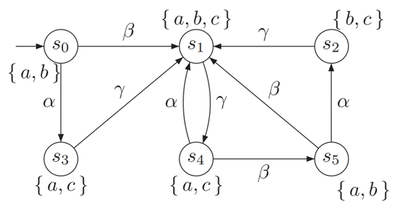

# LTL implementation

This is a program which can parse a given TS (Transition System) and LTL (Linear Time Logic) formulae.
It is written in modern C++ (to be specific, `C++23`), and uses `xmake` as the package manager and program builder.

## Input specification

### Transition system

1. On the first line. input 2 integers, which stands for number of states and transitions.
2. On the second line, input the initial state sets, each integer seperated by a blank.
3. On the third line, input all the actions.
4. On the fourth line, input the symbols associated with each atomic proposition (0-based index).
Note that the symbols should be in form of `[a-z]*` and specially, `true` and `false` are reserved.
5. After that, the following lines each describe a tuple of transition, in the form `(from, action, to)`.
Note that they should be given in form of integers.
6. Finally, the last few lines describe the atomic proposition of each state.

Here's a sample input and its transition system graph.

```txt
6 9
0
α β γ
a b c
0 1 1
0 0 3
3 2 1
1 2 4
2 2 1
5 0 2
5 1 1
4 0 1
4 1 5
0 1
0 1 2
1 2
0 2
0 2
0 1
```



### LTL formula

We use antlr to parse the LTL formulae.

Here we use `!` for `¬`, `/\` for conjunction, `\/` for disjunction, `−>`for implication, `X` for next, `G` for always, `F` for eventually, and `U` for until.

The detailed grammar file is [here](antlr/LTL.g4).

In this part, you should input 2 integers `x` and `y` on the first lines, which represents the number of formulae need to be verified

1. with the given inital set
2. with the initial set as some single state (will be read in later).

On the following `x` lines, input a single LTL formula.

On the following `y` lines, input an integer (which is the single state as the initial state of the TS) and an LTL formula.

## How to test the program online

The easiest way to test the LTL program is to fork [this repo](https://github.com/DarkSharpness/MC),
and upload your own testcases in `csrc/test`. For each testcase, you should provide 3 files:

1. `xxx.ts.txt`, which is the input transition system.
2. `xxx.ltl.txt`, which is the input LTL formulae.
3. `xxx.ans`, which is the answer to these formulae.

See [test](test/) directory to find some examples.

## How to compile the program locally

As we all know, it's painful to configure a C++ environment, so prefer to test the program online
rather than compile locally unless you're confident that you are expert in C++.

Prerequsite: A compiler that supports core syntax of `C++23` (e.g. `gcc 13` or `clang 19`), `xmake`.

```bash
# Install xmake if you don't have that
curl -fsSL https://xmake.io/shget.text | bash

# After you have fulfilled all these prerequisites, run the following command.
# You should run xmake in the root directory (the parent directory where this README lies).
xmake -y

# (Example) Run in the root directory.
xmake run LTL --help
xmake run LTL -S --ts csrc/test/basic/test.ts.txt --ltl csrc/test/basic/test.ltl.txt

# (Optional) After the program successfully built, you may install it to your system
xmake install --admin LTL

# (Optional) If the target program is installed, run the following command
LTL --help
LTL -S --ts csrc/test/basic/test.ts.txt --ltl csrc/test/basic/test.ltl.txt
```

## Implementation Details

<!-- TODO -->
